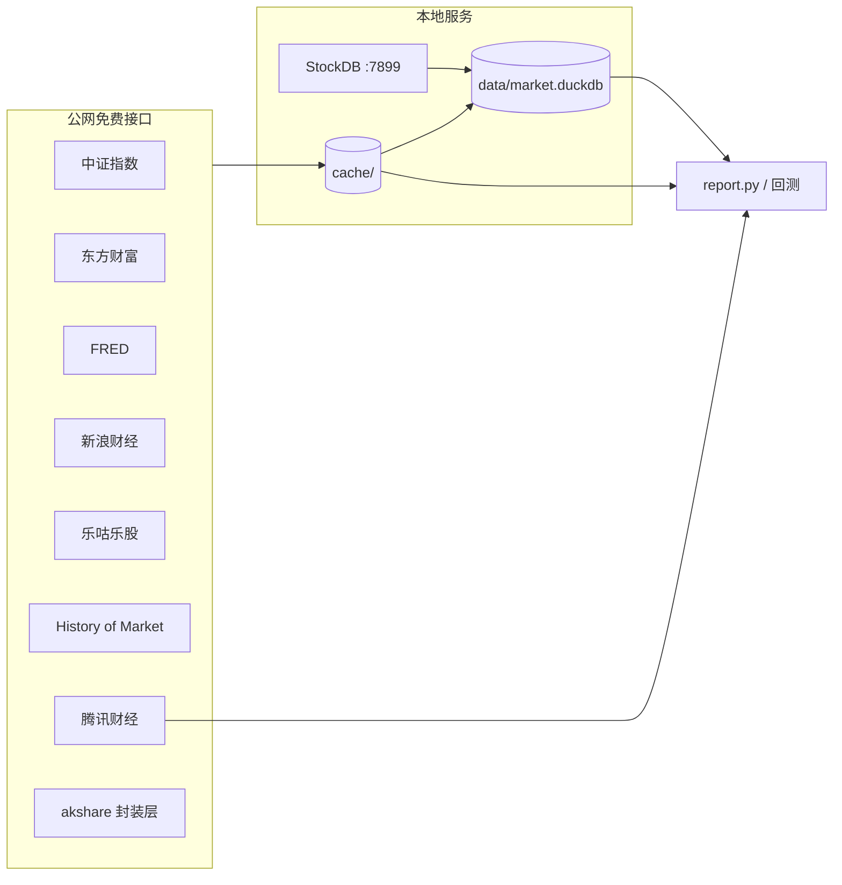

# 外部数据来源总览

本文档汇总项目中**所有外部数据**的来源、地址与用途。URL 常量与结构化注册表以 [`data_sources.py`](data_sources.py) 为权威来源；修改接口时请同步更新该文件与本说明。

```bash
# 终端打印完整注册表
python data_sources.py
```

---

## 数据流架构



**同步入口**（见 [`sync_market_duckdb.py`](sync_market_duckdb.py)）：

| 阶段 | 脚本 | 说明 |
|------|------|------|
| 1 | `sync_data_cache.py` | 公网 → `cache/` CSV/JSON |
| 2 | `duckdb_cache.py` | CSV → DuckDB |
| 3 | `sync_stockdb_to_duckdb.py` | 本地 StockDB → DuckDB（收盘后） |

---

## 一、中证指数（A 股策略 / 宽基 / 红利）

| ID | 数据 | 地址 | 频率 | 调用入口 |
|----|------|------|------|----------|
| `csindex_indicator` | PE、股息率（近约 20 交易日） | `https://oss-ch.csindex.com.cn/static/html/csindex/public/uploads/file/autofile/indicator/{code}indicator.xls` | 日频 | `market_data.read_indicator_history` |
| `csindex_perf` | 收盘价、滚动 PE、成交额 | `https://www.csindex.com.cn/csindex-home/perf/index-perf` | 日频 | `market_data.get_index_perf_history` |
| `csindex_closeweight` | 成分股权重（预留） | `…/closeweight/{code}closeweight.xls` | 调仓日 | 未直接调用 |

**覆盖指数示例**：H30269、000852、000688、000001、000300 等。

**环境变量**：`CSINDEX_INDICATOR_BASE_URL`、`INDEX_PERF_URL`

---

## 二、国债收益率（股债利差）

| ID | 数据 | 地址 | 频率 | 调用入口 |
|----|------|------|------|----------|
| `eastmoney_bond` | 中国 10Y 国债 | `https://datacenter.eastmoney.com/api/data/get`（type=RPTA_WEB_TREASURYYIELD，字段 EMM00166466） | 日频 | `market_data.get_gov_bond_yield` |
| `fred_us10y` | 美国 10Y 国债 DGS10 | `https://fred.stlouisfed.org/graph/fredgraph.csv?id=DGS10` | 日频 | `us_index_data.fetch_us10y_history` |
| `sina_us_bond` | 美国 10Y（回退） | `ak.bond_zh_us_rate()` → 新浪财经 | 日频 | FRED 失败时回退 |

**说明**：中国国债历史缺口由 `config.network.BOND_YIELD_FALLBACK_BY_YEAR` 按年回填。

---

## 三、美股指数（NDX / SPX）

| ID | 数据 | 地址 | 频率 | 调用入口 |
|----|------|------|------|----------|
| `hom_ndx_forward_pe` | 纳指 100 TTM / Forward PE | `https://historyofmarket.com/api/ndx/forward-pe.json` | TTM 日频 / Forward 月频 | `us_index_data.fetch_pe_payload` |
| `hom_spx_forward_pe` | 标普 500 TTM / Forward PE | `https://historyofmarket.com/api/sp500/forward-pe.json` | 同上 | 同上（spx） |
| `fred_nasdaq100` | 纳指 100 价格指数 | `…/fredgraph.csv?id=NASDAQ100` | 日频 | `us_index_data.fetch_price_history` |
| `fred_sp500` | 标普 500 价格指数 | `…/fredgraph.csv?id=SP500` | 日频 | 同上（spx） |
| `shiller_sp` | S&P Composite 月价（1871 起） | `http://www.econ.yale.edu/~shiller/data/ie_data.xls` | 月频 | 美股宽基回测 1957–2003 |
| `sina_us_inx` | 标普 500 日 K | `https://finance.sina.com.cn/staticdata/us/.INX` | 日频 | `ak.index_us_stock_sina('.INX')` |
| `sina_us_ndx` | 纳指 100 日 K | `…/staticdata/us/.NDX` | 日频 | 交叉校验 / 近期补齐 |
| `nasdaq_qqq_summary` | QQQ 股息率代理 NDX | `https://api.nasdaq.com/api/quote/QQQ/summary?assetclass=etf` | 日频 | 辅助展示 |
| `nasdaq_spy_summary` | SPY 股息率代理 SPX | `…/quote/SPY/summary?assetclass=etf` | 日频 | 辅助展示 |

**环境变量**：`NDX_FORWARD_PE_URL`、`SPX_FORWARD_PE_URL`、`FRED_CSV_BASE_URL`

**本地缓存**：`cache/us/*_forward_pe.json`、`*_price_*.csv`

---

## 四、创业板指（399006）

| ID | 数据 | 地址 | 频率 | 调用入口 |
|----|------|------|------|----------|
| `legulegu_pe` / `legulegu_cyb_pe_page` | 创业板滚动 PE（深交所口径） | API: `https://legulegu.com/api/stock-data/market-pe`；页面: `https://legulegu.com/stockdata/cybPE` | 月度 | `cyb_data.fetch_cyb_pe_szse_official` |
| `legulegu_pb` | 创业板 PB | `https://legulegu.com/api/stockdata/index-basic-pb` | 日频 | `cyb_data.fetch_cyb_pb_history` |
| `legulegu_dividend` | 创业板股息率 | `https://legulegu.com/api/stockdata/guxilv` | 日频 | `cyb_data.fetch_cyb_dividend_history` |
| `sina_a_index` | 创业板指日 K | `https://finance.sina.com.cn/realstock/company/sz399006/hisdata/klc_kl.js` | 日频 | `ak.stock_zh_index_daily('sz399006')` |

**说明**：乐咕 PE 为月度发布；`cyb_data` 按指数收盘价折算为日度 PE。乐咕接口经 akshare 调用，需 CSRF Cookie。

---

## 五、实时行情（腾讯财经）

| ID | 数据 | 地址 | 用途 |
|----|------|------|------|
| `tencent_quote` | 指数 / 个股实时价 | `https://qt.gtimg.cn/q={代码}`（批量逗号分隔） | `realtime_quote`（H30269、000852、399006、NDX、SPX 等）；`dividend_lowvol_rotation.quotes`（个股动态股息率） |

**环境变量**：`TENCENT_QUOTE_URL`

---

## 六、红利低波轮动（dividend_lowvol_rotation）

详见 [`dividend_lowvol_rotation/data_sources.md`](dividend_lowvol_rotation/data_sources.md)。

| ID | 数据 | 来源 | akshare / 接口 | 用途 |
|----|------|------|----------------|------|
| `akshare_em_fhps` | 分红方案 | 东方财富 | `ak.stock_fhps_em` | TTM 分红、动态股息率分子 |
| `akshare_em_financial_abstract` | 财务摘要 | 东方财富 | `ak.stock_financial_abstract` | ROE/负债/现金流质量、排雷 |
| `akshare_em_profit_sheet` | 利润表 | 东方财富 | `ak.stock_profit_sheet_by_report_em` | 利息保障倍数回退 |
| `akshare_sw_industry` | 申万一级行业 | 申万宏源 | `index_realtime_sw` + `index_component_sw` | 行业分散 |
| `baostock_industry` | 证监会行业 | Baostock | `bs.query_stock_industry` | 行业降级 |
| `stockdb` | A 股日 K、日历、流动性截面 | 本地 StockDB | `tcp://127.0.0.1:7899` | 回测 K 线、市值/成交额前 90%（与 RQAlpha 对比见 [`docs/stockdb_vs_rqalpha.md`](docs/stockdb_vs_rqalpha.md)） |
| `tencent_quote` | 实时股价 | 腾讯财经 | 见上文 | 动态股息率分母 |

**本地缓存**：`cache/dividend_lowvol/`；**DuckDB**：`data/market.duckdb`（优先于 CSV / StockDB 直查）

**未接入**（文档曾提及但代码未调用）：`ak.stock_dividend_cninfo`、`ak.stock_history_dividend_detail` — 仅作备选方案说明。

---

## 七、本地 StockDB

| 项 | 值 |
|----|-----|
| 地址 | `127.0.0.1:7899`（TCP，非公网 HTTP） |
| SDK | `D:\repository\stockdb\pybao`（`config.paths.STOCKDB_SDK_PATH`） |
| 同步 | `python sync_stockdb_to_duckdb.py`（建议收盘后 17:30 定时任务） |
| 写入 | `data/market.duckdb`（`stock_daily`、`stock_qfq`、交易日历、股票列表） |

StockDB 本身从市场源采集数据；本项目将其作为 **A 股全市场 K 线与流动性** 的本地加速层。

---

## 八、交叉校验 / 诊断（非生产主路径）

| ID | 数据 | 地址 | 脚本 |
|----|------|------|------|
| `multpl_sp500_pe` | 标普 500 Trailing PE | `https://www.multpl.com/s-p-500-pe-ratio/table/by-month` | `scripts/data_crosscheck.py` |
| `yardeni_forward_pe` | Forward P/E 图表 | `https://yardeni.com/charts/forward-p-es/` | 人工对照 |
| `barrons_forward_pe` | Birinyi Forward PE | `https://www.barrons.com/market-data/stocks/us/pe-yields` | curl 抓取（SSL 兼容） |
| `baostock_kline` | A 股日 K | `bs.query_history_k_data_plus` | `scripts/validate_data_baostock.py` |
| `akshare_etf_sina` | ETF 日 K | `ak.fund_etf_hist_sina` | ETF 跟踪 H30269 等抽检 |

---

## 九、推送（非行情）

| ID | 数据 | 地址 | 用途 |
|----|------|------|------|
| `serverchan` | 微信推送 | `https://sctapi.ftqq.com/{SendKey}.send` | `notify.send_wechat` |

注册 SendKey：https://sct.ftqq.com

---

## 十、前端 CDN（回测 HTML 图表）

| 资源 | 地址 | 用途 |
|------|------|------|
| ECharts 5 | `https://cdn.jsdelivr.net/npm/echarts@5/dist/echarts.min.js` | `backtest_html.py`、`backtest_report.py` 内嵌图表 |

---

## 环境变量速查

| 变量 | 默认值来源 |
|------|------------|
| `BOND_YIELD_URL` | 东方财富国债 API |
| `INDEX_PERF_URL` | 中证 perf API |
| `CSINDEX_INDICATOR_BASE_URL` | 中证指标 Excel |
| `TENCENT_QUOTE_URL` | 腾讯行情 |
| `FRED_CSV_BASE_URL` | FRED CSV |
| `NDX_FORWARD_PE_URL` / `SPX_FORWARD_PE_URL` | History of Market |
| `SERVERCHAN_API_URL` | Server 酱 |
| `STOCKDB_HOST` / `STOCKDB_PORT` | 本地 StockDB |
| `BOND_YIELD_TOKEN` | 东财国债 API 可选 token |

完整列表见 `push.example.env` 与 [`config/network.py`](config/network.py)。

---

## 维护约定

1. 新增或变更外部 URL → 更新 `data_sources.py` 常量 + `DATA_SOURCES` 注册表 + 本文件对应章节。
2. 红利低波模块专用数据源 → 同时更新 `dividend_lowvol_rotation/data_sources.md`。
3. DuckDB 域与 source 标签 → 见 [`docs/duckdb.md`](docs/duckdb.md)。
