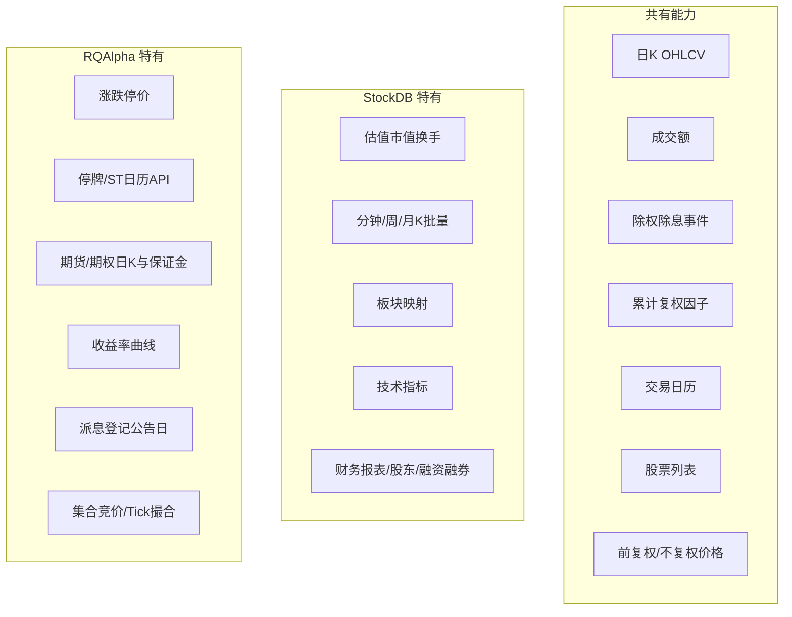

# StockDB vs RQAlpha Bundle — 全量数据对比

> 生成时间：2026-08-20  
> 对比对象：**本地 StockDB**（`127.0.0.1:7899`，SDK：`D:\repository\stockdb\pybao`）与 **RQAlpha 数据包**（默认 `D:\rqalpha\bundle`）  
> 本文覆盖两边**能提供的全部数据类型**，不仅限于 A 股日 K。

---

## 1. 定位与架构

| 维度 | StockDB | RQAlpha Bundle |
|------|---------|----------------|
| 形态 | 本地 TCP 服务 + K-V 存储（`rd`） | 离线 HDF5 / pickle 文件包 |
| 主要用途 | 全市场行情批量读取、因子计算、板块映射、财务查询 | 回测引擎撮合、派息送股、涨跌停/停牌规则 |
| 本项目入口 | `dividend_lowvol_rotation.prices._get_stockdb_client()` | `dividend_lowvol_rotation.rqalpha.rqalpha_bundle_prices` |
| 文档 | `stockdb/调用方式/python/AI策略python开发接口文档.md` | `dividend_lowvol_rotation/rqalpha/README.md` |

StockDB 实际是**三层**能力叠加：

1. **本地 `rd`**：`日k`、`分钟k`、`复权*`、`股票代码`、`退市*` 等（大批量、低延迟）
2. **加工接口 `rd.get_data()`**：复权合成、周/月 K、多周期分钟线
3. **在线 API**（`get_price`、`get_fundamentals` 等）：财务、Tick 补充、融资融券等（小批量，有速率限制）

RQAlpha bundle 是**单一离线包**，通过 `BaseDataSource` 统一读取，面向回测而非研究宽表。

---

## 2. 标的覆盖（Instrument）

### 2.1 RQAlpha bundle 内置标的（实测 **27,696** 个）

| 类型 | 数量（约） | 说明 |
|------|-----------|------|
| `CS`（A 股股票） | 5,564 | 含主板/创业板/科创板 |
| `INDX`（指数） | 8,048 | 含宽基、行业、主题等 |
| `FUTURE`（期货） | 11,203 | 商品/金融期货 |
| `ETF` | 1,788 | |
| `LOF` | 533 | |
| `FUND` | 447 | 部分类型 bar 读取受限 |
| `REITs` | 93 | |
| `REPO`（回购） | 20 | |

### 2.2 StockDB 标的

| 类型 | 本地 `rd` | 在线 API |
|------|-----------|----------|
| A 股股票 | ✅ `日k` / `分钟k` / `股票代码` | ✅ `get_all_securities(types=['stock'])` |
| 指数 | ✅ 可用 `get_data('000001', ...)` 等（字段同个股日 K） | ✅ `get_index_stocks` / `get_index_weights` |
| ETF / 基金 | ⚠️ 视本地同步而定 | ✅ 在线查询 |
| 期货 / 期权 | ❌ 本地无日 K | ✅ 在线 `get_dominant_future`、`get_future_contracts`；财务库含 `FUT_*`、`OPT_*` 表 |
| 债券 | ❌ | ✅ 在线 `bond.*` 表（基本信息、可转债、回购等） |

**结论**：RQAlpha 在**多资产类日 K（股/指/基/期）**上更完整；StockDB 在 **A 股全市场批量 + 分钟线** 上更强，期货/期权/债券主要靠在线财务库。

---

## 3. 行情 K 线 — 频率与字段

### 3.1 支持的频率

| 频率 | StockDB（`get_data`） | RQAlpha（`history_bars`） |
|------|----------------------|---------------------------|
| 日 K `1d` | ✅ | ✅ |
| 周 K `1w` | ✅（合成） | ✅（`resample_week_bars`） |
| 月 K `1M` | ✅（合成） | ❌ |
| 1/5/15/30/60 分钟 | ✅ 本地批量 | ⚠️ API 有 `1m`，bundle 以日 K 为主 |
| Tick | ✅ `frequency='tick'`；在线 `get_ticks` | ✅ `history_ticks` / `get_merge_ticks` |

### 3.2 日 K bar 字段对比

#### StockDB 日 K（`fq='bfq'` 不复权，共 **21 字段**）

```
date, code, name,
open, high, low, close, pre_close,
volume, amount, turnover, pct_chg, amplitude, vol_ratio,
pe_ttm, pb, total_mv, float_mv, total_share, float_share,
is_st
```

分钟线字段与日 K **相同**（实测 `1min` 返回上述 21 列）。

#### RQAlpha 日 K bar（`adjust_type='none'`）

| 资产 | 字段 |
|------|------|
| 股票 / ETF / LOF | `datetime, open, high, low, close, volume, total_turnover, limit_up, limit_down`（**9**） |
| 指数 `INDX` | `datetime, open, high, low, close, volume, total_turnover`（**7**，无涨跌停） |
| 期货 | 结构因合约而异；另有 `get_settle_price` 结算价 |

#### 字段映射（共有部分）

| 含义 | StockDB | RQAlpha | 备注 |
|------|---------|---------|------|
| 交易日 | `date` | `datetime` | 格式不同 |
| 开高低收 | `open/high/low/close` | 同名 | bfq 下实测一致 |
| 成交量 | `volume` | `volume` | 一致 |
| 成交额 | `amount` | `total_turnover` | 同义，误差约百元左右 |

### 3.3 共有 vs 互斥（bar 层）

| 分类 | 字段 |
|------|------|
| **共有** | OHLCV、成交额 |
| **StockDB 特有** | `pre_close`, `turnover`, `pct_chg`, `amplitude`, `vol_ratio`, `pe_ttm`, `pb`, `total_mv`, `float_mv`, `total_share`, `float_share`, `is_st`, `code`, `name` |
| **RQAlpha 特有** | `limit_up`, `limit_down` |

### 3.4 复权

| | StockDB | RQAlpha |
|---|---------|---------|
| 不复权 | `fq=None` / `bfq` | `adjust_type='none'` |
| 前复权 | `fq='qfq'` | `adjust_type='pre'` |
| 后复权 | `fq='hfq'` | `adjust_type='post'` |
| 因子存储 | `复权*` 表：`div/give/trans/mult/cum`（约 5.8 万条事件） | `dividends.h5` + `split_factor.h5` + `ex_cum_factor.h5` |

**重要**：前复权 **不能跨源直接对比**（高分红股偏差显著）；**不复权 OHLCV 在共有交易日实测一致**（见 §8）。

---

## 4. 公司行动（分红 / 送股 / 除权）

### 4.1 StockDB — `复权*` 键空间

每条事件键名：`复权:{code}:{YYYYMMDD}`，子字段：

| 字段 | 含义 |
|------|------|
| `div` | 每股现金分红 |
| `give` | 送股 |
| `trans` | 转增 |
| `mult` | 除权乘数 |
| `cum` | 累计复权因子 |

用于 SDK 内部计算 `qfq`/`hfq`，**无**公告日、登记日、派息日等完整披露字段。

### 4.2 RQAlpha — 结构化公司行动

**分红** `get_dividend()`：

```
book_closure_date, announcement_date, dividend_cash_before_tax,
ex_dividend_date, payable_date, round_lot
```

**送股/拆股** `get_split()`：

```
ex_date, split_factor, split_coefficient_to, split_coefficient_from
```

**累计除权因子** `get_ex_cum_factor()`：`(datetime, factor)` 序列

**股本变更** `get_share_transformation()`：特殊转板/换股（较少见）

| 分类 | 说明 |
|------|------|
| **共有（语义）** | 除权日、现金分红、送股转增、累计复权因子 |
| **StockDB 特有** | 统一在 `复权*` 五字段模型，键值存储 |
| **RQAlpha 特有** | 公告日、股权登记日、派息日、每手股数 `round_lot`；拆股系数 to/from |

---

## 5. 交易状态与规则

| 数据 | StockDB | RQAlpha |
|------|---------|---------|
| 停牌 | ❌ 无独立 API（可从成交量推断） | ✅ `suspended_days.h5` + `is_suspended()` |
| ST | ✅ 日 K 字段 `is_st` | ✅ `st_stock_days.h5` + `is_st_stock()` |
| 涨跌停价 | ❌ | ✅ bar 字段 `limit_up` / `limit_down` |
| 集合竞价 | ❌ 本地 | ✅ `get_open_auction_bar()` / `get_open_auction_volume()` |
| 最小交易单位 | ❌ | ✅ instrument `round_lot`（100 股） |
| 期货保证金/手续费 | ❌ | ✅ `get_futures_trading_parameters()` |
| 期货结算价 | ❌ | ✅ `get_settle_price()` |

---

## 6. 标的元数据

| 字段 | StockDB | RQAlpha |
|------|---------|---------|
| 股票列表 | ✅ `股票代码`（按 0/1/3/5/6/9 前缀分类） | ✅ `instruments.pk` |
| 上市/退市日 | ⚠️ 在线 `get_security_info` | ✅ `listed_date` / `de_listed_date` |
| 板块/行业 | ✅ `bk.get()`：同花顺概念 + 申万一/二/三级 | ⚠️ 在线 `get_industry` / `get_concepts`（非 bundle） |
| 退市股映射 | ✅ `退市*` 表 | ⚠️ instrument `de_listed_date` |
| 证券名称 | ✅ 日 K 内嵌 `name` | ✅ `symbol` |
| 板块类型 | ✅ `board_type` 无；行业在 `bk` | ✅ `board_type`（MainBoard/GEM/KSH 等） |

---

## 7. 交易日历

| | StockDB | RQAlpha |
|---|---------|---------|
| 来源 | `get_data('000001', frequency='1d').date` 或在线 `get_trade_days` | `trading_dates.npy` + `get_trading_calendars()` |
| 范围 | 随本地同步（本项目约 2000 年起） | 实测 `CN_STOCK`：2005-01-04 ~ 2027-12-31 |
| 分钟级时间轴 | ❌ | ✅ `get_trading_minutes_for()` |

---

## 8. 一致性验证摘要（StockDB bfq vs RQAlpha none）

抽样条件：纯 A 股（600/000/300/688 等），2024 全年，随机 50 只 + 固定关注股。

| 指标 | 结果 |
|------|------|
| 有效样本 | 45 / 55 |
| OHLCV 完全一致 | **45 / 47**（97%） |
| 仅日期不一致、价格一致 | 5 只（RQ 多 1~10 个交易日） |
| 价格超差（>0.02 元） | **0** |
| 最新交易日（抽查） | 两边均至 **2025-08-20** |

前复权：`000036`、`688981` 全年一致；`600519`、`601919` 等高分红股 **全年不一致**（算法差异，非 bfq 错误）。

---

## 9. StockDB 特有数据（RQAlpha 不提供）

### 9.1 本地 `rd` 表

| 表/键 | 内容 |
|-------|------|
| `日k` | 全市场个股日 K 原始宽表 |
| `分钟k` | 全市场分钟 K |
| `复权*` | 全市场除权事件与累计因子 |
| `股票代码` | 分类股票列表 |
| `退市*` | 退市股序列号 → 代码映射 |
| `./mydb` | 用户私有写入空间（策略因子、缓存等） |

### 9.2 技术指标 `zb.get()`

内置 **30+** 指标（本地计算，不额外请求行情）：

```
ma, ema, sma, wma, dma, std, sum, hhv, llv, ref,
macd, kdj, rsi, wr, bias, boll, psy, cci, atr, bbi,
dmi, taq, ktn, trix, vr, cr, emv, dpo, brar, dfma,
mtm, mass, roc, expma, obv, mfi, asi, xsii, zhishu
```

另支持 `zhishu` 自定义指数合成（等权/市值/成交额加权）。

### 9.3 板块 `bk.get()`

- 同花顺概念（`ths`）
- 申万一级 / 二级 / 三级（`sw`）
- 股票 ↔ 板块双向查询

### 9.4 在线 API（小批量补充）

**行情与交易**

```
get_price, get_bars, get_ticks, get_last_tick, get_call_auction,
get_extras, get_money_flow, get_mtss,
get_margincash_stocks, get_marginsec_stocks
```

**证券与分类**

```
get_trade_days, get_all_securities, get_security_info,
get_industry, get_concepts, get_industries,
get_concept_stocks, get_industry_stocks,
get_index_stocks, get_index_weights
```

**财务与因子**

```
get_fundamentals, get_fundamentals_continuously,
get_fund_info, get_valuation,
get_billboard_list, get_locked_shares,
get_factor_values, get_factor_kanban_values,
get_index_style_exposure
```

**财务表根节点**（`query` 体系）：

| 根 | 典型表 |
|----|--------|
| `valuation` | 市值、PE、PB 等估值截面 |
| `income` | 利润表 |
| `balance` | 资产负债表 |
| `cash_flow` | 现金流量表 |
| `indicator` | 财务指标 |
| `bond` | 债券基本信息、可转债、回购行情等 |
| `finance` | 股东、质押、解禁、沪深港通、基金持仓、期货持仓排名等 **40+** 表 |
| `opt` | 期权合约、日行情、行权信息等 |

**衍生品**

```
get_dominant_future, get_future_contracts
```

---

## 10. RQAlpha 特有数据（StockDB 不提供）

### 10.1 Bundle 文件

| 文件 | 内容 |
|------|------|
| `stocks.h5` | A 股日 K |
| `indexes.h5` | 指数日 K |
| `funds.h5` | 基金日 K |
| `futures.h5` | 期货日 K |
| `dividends.h5` | 分红 |
| `split_factor.h5` | 拆股/送股 |
| `ex_cum_factor.h5` | 累计除权因子 |
| `suspended_days.h5` | 停牌日 |
| `st_stock_days.h5` | ST 日 |
| `instruments.pk` | 全市场标的元数据 |
| `trading_dates.npy` | 交易日 |
| `yield_curve.h5` | 国债收益率曲线 |
| `future_info.json` | 期货合约信息 |
| `share_transformation.json` | 股本特殊变更 |

### 10.2 独有 API

| API | 用途 |
|-----|------|
| `is_suspended()` / `is_st_stock()` | 回测日级状态判断 |
| `get_open_auction_bar/volume()` | 集合竞价 |
| `get_futures_trading_parameters()` | 期货手续费、保证金 |
| `get_settle_price()` | 期货结算价 |
| `get_yield_curve()` | 收益率曲线（0S~50Y，21 个期限） |
| `get_exchange_rate()` | 汇率 |
| `current_snapshot()` | 当前 bar 快照 |
| `history_ticks()` / `get_merge_ticks()` | Tick 级历史 |
| `get_algo_bar()` | 算法交易分钟 bar |
| `get_share_transformation()` | 特殊股本变更 |

---

## 11. 共有数据总览



| 共有类别 | 对齐建议 |
|----------|----------|
| 不复权日 K OHLCV | ✅ 可直接对比（`StockDB fq=bfq` ↔ `RQAlpha adjust_type=none`） |
| 成交额 | ✅ 字段名不同，数值基本一致 |
| 分红/送股事件 | ⚠️ 语义共有，字段模型不同，需映射 |
| 前复权收盘价 | ⚠️ 无分红股可一致；高分红股勿跨源对比 |
| 交易日历 | ⚠️ 范围与更新节奏可能不同，回测以 RQAlpha 为准 |
| 股票池 | ⚠️ RQAlpha 含 ETF/期货等；纯 A 股取交集约 5500+ |

---

## 12. 本项目使用建议

| 场景 | 推荐数据源 | 原因 |
|------|-----------|------|
| RQAlpha 回测成交价 | RQAlpha bundle（bfq） | 与引擎 bar 同源，含涨跌停/停牌 |
| 原生回测（`DLV_BACKTEST_PRICE_SOURCE=rqalpha`） | 同上 | 已与 RQ 路径 NAV 对齐 |
| 波动率 / 动量因子 | StockDB（qfq） | 宽表批量、前复权方便 |
| 流动性截面（市值、成交额） | StockDB | 含 `total_mv`、`amount` |
| 现金分红 / 红利税 | RQAlpha | 完整派息日与 `round_lot` |
| 排雷 / 财务因子 | 东财 akshare（非二者） | 本项目未用 StockDB 财务库 |
| 交叉校验行情 | StockDB bfq ↔ RQAlpha none | 已验证高度一致 |

---

## 13. 参考

- StockDB 接口文档：`D:\repository\stockdb\调用方式\python\AI策略python开发接口文档.md`
- StockDB MCP 财务表清单：`D:\repository\stockdb\调用方式\ai_mcp\stockdb_full_mcp.py` → `RUN_QUERY_TABLES`
- 本项目数据源总览：[`DATA_SOURCES.md`](../DATA_SOURCES.md)
- RQAlpha 迁移说明：[`dividend_lowvol_rotation/rqalpha/README.md`](../dividend_lowvol_rotation/rqalpha/README.md)
- 行情读取代码：`dividend_lowvol_rotation/prices.py`、`dividend_lowvol_rotation/rqalpha/rqalpha_bundle_prices.py`

---

*本报告基于本地环境实测与官方 SDK 文档整理；StockDB 在线 API 与本地 `rd` 同步范围以你本机 `数据更新.exe` 完成情况为准。*
